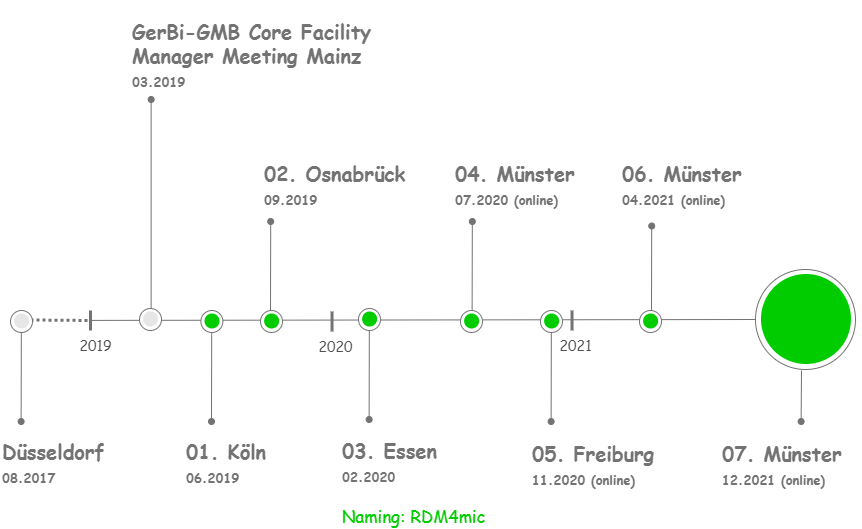

## RDM4Mic - Research Data Management for Microscopy

Initiated by Susanne Kunis (CellNanOs, Osnabrueck), Stefanie Weidtkamp-Peters (CAi, Duesseldorf) and Astrid Strauss (CECAD, Cologne), this group started its work in 2019 and deals with the topic of research data management for microscopy ([overview](https://github.com/German-BioImaging/RDM4mic/blob/master/presentations/Rdm4mic_landscape_elmi2021.pdf)). Presently the group has 76 members from different institutions.

The meetings are about:

- Strategies for image data management
- Requirements and resources needed to set up a local image repository
- Available software, tools, workflows and standards
- Handling of change management

The work of RDM4mic has been funded by the DFG through the [I3D:bio Project](https://gerbi-gmb.de/i3dbio/i3dbio-about/) (2022-2025) and is supported through the NFDI4BIOIMAGE consortium (DFG grant: NFDI 46/1 – 501864659)

---

### News:

We are excited to invite you to the **RDM4mic Meeting 2026, taking place from October 7th to October 9th, 2026 at the CECAD Research Center & MPI for Biology of Ageing in Cologne**.
Join us for three days of vibrant discussions, networking, and knowledge-sharing on research data management, FAIR image data workflows, and tools for microscopy. Whether you are a core facility manager, bioimage analyst, data steward, developer or researcher, we look forward to exchanging ideas with you!

Date : **October 7–9, 2026**
Location : **CECAD & MPI AGE, Cologne, Germany**
Registration : [Click here to Register](https://forms.gle/BJMQBhe9FFqeqeEZ7)
Preliminary Program : [Click here to View](https://hackmd.io/Z0IahqkXSIunxN1F7ITxuw)
Spaces are limited, so please secure your spot early. We would appreciate it if you could contribute to a talk or a topic for the workshop. The deadline for this is 10 September 2026.
If you are new to RDM4mic, there is a planned virtual intro session on October 1. Further details will be announced in due course.
 
---

### Meetings:

- [10.2025](https://hackmd.io/@marietovelill/RDM4mic2025)
- [09.2023](https://github.com/German-BioImaging/RDM4mic/tree/master/meetings/2023-09)
- [05.2022](https://github.com/German-BioImaging/RDM4mic/tree/master/meetings/2022-05)
- [12.2021](https://github.com/German-BioImaging/RDM4mic/blob/master/meetings/2021-12)
- [04.2021](https://github.com/German-BioImaging/RDM4mic/tree/master/meetings/2021-04)
- [11.2020](https://github.com/German-BioImaging/RDM4mic/tree/master/meetings/2020-11)
- [07.2020](https://github.com/German-BioImaging/RDM4mic/tree/master/meetings/2020-07)
- [02.2020](https://github.com/German-BioImaging/RDM4mic/tree/master/meetings/2020-02)
- [09.2019](https://github.com/German-BioImaging/RDM4mic/tree/master/meetings/2019-09)
- [06.2019](https://github.com/German-BioImaging/RDM4mic/tree/master/meetings/2019-06)

### Mailing list
[subscribe here](https://www.listserv.dfn.de/sympa/info/rdm4mic)

### Contact
[Susanne Kunis](<sukunis@uos.de>)
