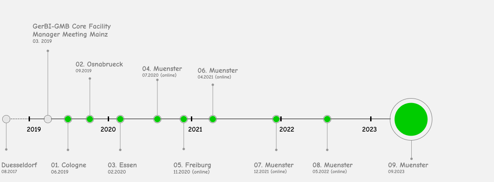

## RDM4Mic - Research Data Management for Microscopy

Initiated by Susanne Kunis (CellNanOs, Osnabrueck), Stefanie Weidtkamp-Peters (CAi, Duesseldorf) and Astrid Strauss (CECAD, Cologne), this group started its work in 2019 and deals with the topic of research data management for microscopy ([overview](https://github.com/German-BioImaging/RDM4mic/blob/master/presentations/Rdm4mic_landscape_elmi2021.pdf)). Presently the group has 47 members from different institutions.

The meetings are about:

- Strategies for image data management
- Requirements and resources needed to set up a local image repository
- Available software, tools, workflows and standards
- Handling of change management

---

### News:

The work of RDM4mic is funded by the DFG with the [I3D:bio Project](https://gerbi-gmb.de/i3dbio/i3dbio-about/) (2021-2023).

---

### Meetings:

 

- [05.2022](https://github.com/German-BioImaging/RDM4mic/tree/master/meetings/2022-05)
- [12.2021](https://github.com/German-BioImaging/RDM4mic/blob/master/meetings/2021-12)
- [04.2021](https://github.com/German-BioImaging/RDM4mic/tree/master/meetings/2021-04)
- [11.2020](https://github.com/German-BioImaging/RDM4mic/tree/master/meetings/2020-11)
- [07.2020](https://github.com/German-BioImaging/RDM4mic/tree/master/meetings/2020-07)
- [02.2020](https://github.com/German-BioImaging/RDM4mic/tree/master/meetings/2020-02)
- [09.2019](https://github.com/German-BioImaging/RDM4mic/tree/master/meetings/2019-09)
- [06.2019](https://github.com/German-BioImaging/RDM4mic/tree/master/meetings/2019-06)

### Mailing list
[subscribe here](https://www.listserv.dfn.de/sympa/info/rdm4mic)

### Contact
[Susanne Kunis](<sukunis@uos.de>)
